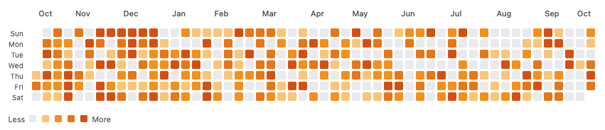
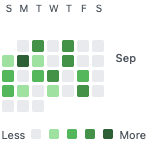

# weekwide-timeline

A GitHub-style contribution graph web component for visualizing temporal data.

## Normal, wide year view



## Custom date range, vertical view




## Features

- 📊 **GitHub-style visualization** - Familiar contribution graph layout
- 📅 **Flexible date ranges** - Display year, custom ranges, or specific periods
- 🔄 **Multiple orientations** - Horizontal (default) or vertical layout
- 📏 **Sizing options** - Full size or fixed size with scrolling
- 🎨 **Color schemes** - Green, blue, purple, orange, red
- 🖱️ **Interactive** - Hover tooltips and click events
- ⚙️ **Highly configurable** - Cell size, gaps, labels, legend, and more
- 📦 **Zero dependencies** - Pure vanilla JavaScript web component

## Installation

### For Development (using npm link)

```bash
cd ~/REPOS/weekwide-timeline
npm install
npm link

# In your consuming project
npm link @mmmlib/weekwide-timeline
```

### For Production (using GitHub)

Add to your package.json:

```json
{
  "dependencies": {
    "@mmmlib/weekwide-timeline": "github:smurp/weekwide-timeline#main"
  }
}
```

Then:

```bash
npm install
```

## Usage

### Basic Usage

```html
<script type="module" src="path/to/weekwide-timeline.js"></script>
<weekwide-timeline></weekwide-timeline>
```

```javascript
const timeline = document.querySelector('weekwide-timeline');

// Set data (object with YYYY-MM-DD keys)
timeline.setData({
  '2025-01-15': 5,
  '2025-01-16': 12,
  '2025-01-17': 3,
  // ...
});

// Or use a Map
const dataMap = new Map();
dataMap.set('2025-01-15', 5);
dataMap.set('2025-01-16', 12);
timeline.setData(dataMap);
```

### Configuration

```javascript
const timeline = document.querySelector('weekwide-timeline');

// Orientation
timeline.orientation = 'vertical'; // 'horizontal' | 'vertical'

// Date range
timeline.startDate = '2024-01-01';
timeline.endDate = '2024-12-31';

// Display options
timeline.fixedSize = true; // Enable scrolling
timeline.cellSize = 15; // 8-20 pixels
timeline.cellGap = 4; // 1-10 pixels

// Visual styling
timeline.colorScheme = 'blue'; // 'green' | 'blue' | 'purple' | 'orange' | 'red'
timeline.showMonthLabels = true;
timeline.showDayLabels = true;
timeline.showLegend = true;
timeline.verticalMonthLabels = true; // Vertical text in vertical mode
```

### Events

```javascript
timeline.addEventListener('day-selected', (e) => {
  console.log('Selected date:', e.detail.date); // 'YYYY-MM-DD'
  console.log('Value:', e.detail.value);
  console.log('Date object:', e.detail.dateObject);
});
```

### Methods

```javascript
// Set or update data
timeline.setData({ '2025-01-15': 5 });

// Add/update single data point
timeline.setDataPoint('2025-01-16', 10);

// Clear all data
timeline.clearData();
```

## API Reference

### Properties

| Property | Type | Default | Description |
|----------|------|---------|-------------|
| `orientation` | `'horizontal' \| 'vertical'` | `'horizontal'` | Layout direction |
| `startDate` | `Date \| string \| null` | `null` | Start date (null = 1 year ago) |
| `endDate` | `Date \| string \| null` | `null` | End date (null = today) |
| `fixedSize` | `boolean` | `false` | Enable fixed size with scrolling |
| `cellSize` | `number` | `12` | Cell size in pixels (8-20) |
| `cellGap` | `number` | `3` | Gap between cells (1-10) |
| `colorScheme` | `string` | `'green'` | Color scheme |
| `showMonthLabels` | `boolean` | `true` | Show month labels |
| `showDayLabels` | `boolean` | `true` | Show day of week labels |
| `showLegend` | `boolean` | `true` | Show Less/More legend |
| `verticalMonthLabels` | `boolean` | `true` | Vertical text for months in vertical mode |

### Methods

| Method | Parameters | Description |
|--------|------------|-------------|
| `setData(data)` | `Object \| Map` | Set all timeline data |
| `setDataPoint(date, value)` | `string, number` | Add/update single point |
| `clearData()` | - | Clear all data |

### Events

| Event | Detail | Description |
|-------|--------|-------------|
| `day-selected` | `{ date, value, dateObject }` | Fired when day is clicked |

## Data Format

Data must be provided as an object or Map with ISO date strings (`YYYY-MM-DD`) as keys and numeric values:

```javascript
// Object format
{
  '2025-01-15': 5,
  '2025-01-16': 12,
  '2025-01-17': 3
}

// Map format
const data = new Map();
data.set('2025-01-15', 5);
data.set('2025-01-16', 12);
```

**Key Points:**
- Date format must be `'YYYY-MM-DD'` (ISO 8601)
- Values are numbers representing activity/contribution level
- Missing dates automatically show as empty (value 0)
- Color intensity automatically scales to maximum value

## Examples

### Display Last 90 Days

```javascript
const timeline = document.querySelector('weekwide-timeline');
const today = new Date();
const ninetyDaysAgo = new Date(today);
ninetyDaysAgo.setDate(today.getDate() - 90);

timeline.startDate = ninetyDaysAgo;
timeline.endDate = today;
timeline.colorScheme = 'blue';
```

### Vertical Timeline with Custom Colors

```javascript
const timeline = document.querySelector('weekwide-timeline');
timeline.orientation = 'vertical';
timeline.colorScheme = 'purple';
timeline.cellSize = 15;
timeline.verticalMonthLabels = false; // Horizontal text
```

### Fixed Size Container with Scrolling

```javascript
const timeline = document.querySelector('weekwide-timeline');
timeline.fixedSize = true;
// Horizontal: scrolls left-right
// Vertical: scrolls up-down
```

## Integration with MMM

The weekwide-timeline component is designed to work seamlessly with the MMM ecosystem:

```javascript
// In your MMM application
import '@mmmlib/weekwide-timeline';

const timeline = document.querySelector('weekwide-timeline');

// Fetch temporal data from MMM
const data = await mmmServer.query({
  subject: 'user:activity',
  predicate: 'logged-at'
});

// Transform to timeline format
const timelineData = {};
data.forEach(quad => {
  const date = new Date(quad.at).toISOString().split('T')[0];
  timelineData[date] = (timelineData[date] || 0) + 1;
});

timeline.setData(timelineData);
```

## Orientation Modes

### Horizontal (Default)
- Timeline flows left-to-right
- Days of week stack vertically (Sun-Sat)
- Month labels appear above
- Scrolls horizontally when `fixedSize` is enabled

### Vertical
- Timeline flows top-to-bottom
- Days of week spread horizontally (S M T W T F S)
- Month labels appear to the right
- Month labels can be vertical or horizontal text
- Scrolls vertically when `fixedSize` is enabled

## Color Schemes

Available color schemes:
- **green** - Classic GitHub green (default)
- **blue** - Cool blue tones
- **purple** - Rich purple gradient
- **orange** - Warm orange tones
- **red** - Bold red palette

Each scheme has 4 intensity levels plus an empty state, automatically scaled to your data's maximum value.

## Development

```bash
cd ~/REPOS/weekwide-timeline
npm run dev
# Visit http://localhost:8004/example/
```

## Browser Support

Modern browsers with ES6 and Web Components support:
- Chrome 54+
- Firefox 63+
- Safari 10.1+
- Edge 79+

## License

AGPL-3.0-or-later

## Related Components

- [@mmmlib/ttl-editor-form](https://github.com/smurp/ttl-editor-form) - Turtle ingestion
- [@mmmlib/quad-form](https://github.com/smurp/quad-form) - Quad editor
- [@mmmlib/mntl-space-fab](https://github.com/smurp/mntl-space-fab) - Mental space picker
- [@mmmlib/prefixes-form](https://github.com/smurp/prefixes-form) - Prefix management

## Contributing

This component follows the [MMM WebComponent Integration Standard](../docs/WC_for_the_MMM.md).

## Questions?

Open an issue at [smurp/weekwide-timeline](https://github.com/smurp/weekwide-timeline)